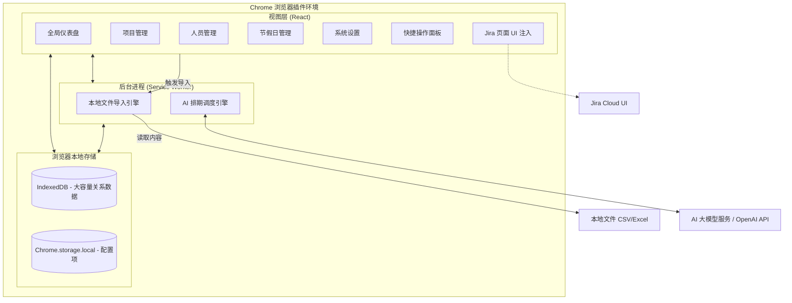
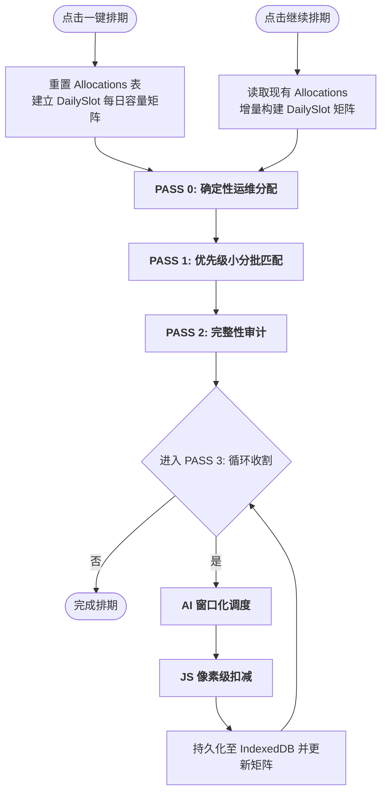

# 智能研发资源排期系统 (Intelligent Resource Planner) - 规划文档

**⚠️ 架构与设计维护说明 (For AI Agents):**
> 任何关于本项目的功能变更、架构调整（如更换数据源、修改核心业务流程）都**必须**同步更新至本文档，确保它始终作为项目设计的 Single Source of Truth。

## 一、 产品需求文档 (PRD)

### 1.1 项目背景与目标
在软件开发过程中，项目经理和资源主管经常面临多项目并行、资源瓶颈难以识别的痛点。尤其是在季度规划时，开发、测试等研发资源的分配需要平衡项目优先级和人员技能。本项目旨在打造一款 AI 辅助的资源排期与预警系统，帮助团队合理调配资源，提前发现过载风险。

### 1.2 目标用户
*   **项目经理 (PM) / 敏捷教练 (Scrum Master)**：负责项目整体排期，监控资源使用情况。
*   **研发主管 / 测试主管 (Resource Managers)**：管理团队成员技能标签，分配具体人员到项目。

### 1.3 核心业务流程
1.  **数据导入 (Manual File Import)**：用户在插件的“项目管理”页面（Projects）通过手动上传 CSV 或 Excel (.xlsx) 文件来导入待排期项目列表。
    * 页面提供了**「下载模板 (CSV)」**功能，方便用户获取包含标准表头的样例文件。
    * 系统通过智能表头匹配提取以下核心信息：项目名称、业务方、优先级、状态、各项负责人 (Digital Responsible, Tech Lead, Quality Lead)、起止及上线时间、预估的开发/测试总人天 (Total MD) 以及具体的任务明细 (Details Product MD) 和技术域 (Tech Stack, Domain)。
2.  **资源图谱**：主管在插件的独立管理页（Options Page）中维护团队成员在不同产品域的开发/测试能力标签及当前可用性，数据存储在本地。
    * 支持通过手动上传 CSV 或 Excel 批量导入团队成员。
    * 提供包含标准角色与技能标签的下载模板。
    * 支持将当前人员列表导出为 CSV 文件。
3.  **智能排期**：在季度规划期间，PM 在插件看板一键触发 AI 排期，插件直接调用大模型 API（如 OpenAI），根据优先级规则、项目工时预估、资源技能标签和当前负荷，推荐排期方案。
4.  **实时预警 (Jira 联动)**：当 PM 浏览 Jira 页面时，插件的 Content Script 实时读取本地缓存的排期数据，在页面上无侵入式注入并提示当前项目指派人的资源超载/闲置风险。

#### 1.4 核心功能模块 (Core Features)

#### 1.4.1 标准角色定义 (Standard Roles)
系统预设以下 5 种标准研发角色，并自动与项目工时评估（MD）进行匹配：
*   **前端工程师 / 后端工程师 / APP工程师**：属于开发力量，主要负责 `devTotalMd`（开发工时）。
*   **全栈工程师**：**属于开发力量**，具有通用性，可灵活参与前端或后端的 `devTotalMd` 任务。全栈工程师只负责开发，不参与测试工作。
*   **测试工程师**：专门负责 `testTotalMd`（测试工时）。

#### 1.4.2 资源缺口与闲置分析 (Gap & Idle Analysis)
排期完成后，系统会自动执行双向审计：
*   **项目视角**：对比项目所需的 `devTotalMd` / `testTotalMd` 与实际排期人天。系统将排期结果精细拆分为三类：**已排满项目**、**部分排上项目** 和 **排不上项目**。对于排不上的项目，系统会通过启发式算法自动归因推断（如“开发容量不足”、“测试容量不足”、“Lead 不可用”或“时间窗口不足”）。
*   **资源视角 (Scrum 团队容量与个人闲置)**：在选定的时间跨度内，计算人员的可用总工时与已排期工时的差值。系统在大盘新增了**「Scrum 团队容量」**可视化区块，按团队聚合计算总容量、已用容量以及细分的开发/测试剩余闲置天数。未满载的具体人员也会在「待补充任务」看板中呈现。

*   **项目分类管理 (Project Categorization)**：为了确保排期的有效性，系统将项目分为两类：
    *   **待排期项目 (Ready for AI)**：已填写 `devTotalMd` 或 `testTotalMd` 的项目。这类项目会参与 AI 智能排期计算，并出现在资源分配大盘中。
    *   **待评估项目 (Pending Assessment)**：尚未评估工时（MD 为 0）的项目。这类项目不参与 AI 排期，但会展示在大盘底部的独立清单中，提醒 PM 及时跟进评估。
*   **节假日与日历可配置 (Configurable Holiday Calendar)**：
    *   **日历管理**：独立页面，允许用户自定义法定节假日（休息日）和调休工作日（周末上班）。
    *   **动态排期计算**：修改后立即持久化到本地 IndexedDB，AI 智能排期将严格遵守最新的自定义日历设置。
*   **Scrum 团队管理 (Scrum Teams Management)**：
    *   独立的 Scrum 团队管理模块，支持按 Scrum 组织研发与测试资源，支持跨团队分配人员与安全的级联解除策略。人员的 CSV 导入与导出操作全面集成 `Scrum Team` 的自动识别与新建。当团队被解散时，系统不仅清理成员归属，还会将所属项目的排期模式强制降级为 `all-in` (全局统筹)，防止项目因丢失约束实体陷入死锁。
*   **技能管理 (Skills Management)**：独立页面，管理团队的「业务领域能力」与「技术能力」标签。支持标签的 CRUD 操作以及批量导入。
*   **项目管理 (Project Management)**：独立页面，展示所有待排期项目的详细清单（项目名、负责人、起止日期、评估工时等），并支持按优先级从高到低自动排序。
*   **本地文件导入 (CSV/XLSX Import)**：支持通过手动上传 CSV 或 Excel 批量导入项目、资源与运维配置。
*   **Jira 预警机制 (Alerts)**：对资源超量分配进行红绿灯预警，并在 Jira 原生 Issue 页面中悬浮展示。

---

## 二、 系统架构图 (Local-first Chrome Extension Architecture)

本系统采用纯客户端（Local-first）架构，所有数据存储在用户的浏览器本地缓存中，无独立后端服务器。

---

## 三、 关键技术方案 (Key Technical Solutions)

#### 3.3.1 本地文件导入与项目管理
*   **优先级逻辑**：系统严格遵循「从上到下」的物理顺序规则。文件导入时，排在顶部的项目具有最高优先级。
*   **展示与排期一致性**：无论是「项目管理」页面的列表展示，还是「全局排期大盘」的 AI 自动排期，都统一使用数据库自增 ID 作为顺序基准，确保 UI 显示顺序、业务优先级顺序与 AI 逻辑完全对齐。

#### 3.3.2 时间槽位矩阵统筹与收敛循环 (Time Slot Matrix & Convergence Loops)
系统已进化至统筹大师级调度架构，通过「像素级」建模和「贪心循环」实现资源利用率的极致挖掘：

1.  **DailySlot 每日容量建模**：系统为每位员工在排期窗口内建立完整的日历矩阵。每一天都是一个独立的调度单元，精确记录 `usedCapacity`。
2.  **增量调度支持 (Continue Scheduling)**：系统新增「继续排期」功能。与传统的全量覆盖不同，该模式会保留数据库中已有的分配方案，将其视为不可动的“时间槽位”并增量构建日历矩阵。这使得用户可以分批次导入项目并进行追加调度，而不破坏已达成的排期共识。
3.  **高性能内存矩阵 (Incremental Shared Matrix)**：矩阵状态在调度会话中增量维护。每当一条 AI 建议被应用，系统仅针对受影响的人员做局部 Slot 更新，消除了在循环内触发全量审计的性能瓶颈。
4.  **O(1) 级算法优化**：
    *   **集合化查询**：节假日与调休日列表在初始化时即转为 `Set` 结构，确保每日状态判定的时间复杂度为 O(1)。
    *   **工作日预计算**：系统在排期启动前一次性预生成排期窗口内的完整工作日集合，后续所有 MD 推算和 `endDate` 计算均直接查表。
5.  **AI 窗口化感知与智能白名单裁剪 (Windowed Awareness & Smart Pruning)**：传给 AI 精确的 `Available Windows` 列表。针对 Token 成本，系统会自动裁剪过长的日历摘要（截断为最近 3 个空闲窗口），并在向大模型请求前，根据 Scrum 团队约束提前从候选池剔除不合法的越界资源，彻底消灭 AI 产生幻觉或越界分配的可能性。
6.  **收敛收割循环 (Convergence Loops)**：最后的收割阶段执行最多 3 轮的贪心补排，直到分配结果达到数学意义上的收敛。
7.  **排期完整性回滚 (All-or-Nothing Rollback)**：强制执行事务检查。若项目无法完成"研发+测试"闭环，或开发分配严重欠配（<50%）且测试完全未排，则果断释放占位资源。对 `endDate > scheduleMaxDate` 的跨窗口项目，跳过回滚并标记 `partial_window` 状态，允许部分排期。
8.  **毫秒级响应中断 (Aggressive Interruption)**：通过 `AbortController` 实现，点击停止后会立即取消正在进行的 AI 异步请求及后续处理。
9.  **全链路精度保持**：内部计算（缺口、闲置、分配额）全程采用浮点数传递，仅在最终写入数据库和 UI 展现时进行四舍五入，杜绝累积偏差。
10. **运维全天分配 (Ops Full-Day Allocation)**：PASS 0 中，无论月度运维人天大小，系统一律按全天（100%）模式将运维天数均匀分散到可用工作日。每人每天只能执行一个任务（运维或项目），不存在日内百分比分摊。
11. **模糊日期自动解析 (Fuzzy Date Normalization)**：CSV 导入时 `normalizeDateField()` 自动将 "Apr"、"Q3"、"March"、"Jun (UAT done...)" 等非标日期转为 ISO 格式（startDate 取月首日，endDate 取月末日），确保排期引擎能正确识别项目起止窗口。

#### 3.3.3 排期精准度与策略优化 (Scheduling Precision & Strategies)
为提升 AI 分配的合理性与资源利用率，系统在底层引入了多项高级调度特性：
1. **两阶段分离排期 (Two-Phase Scheduling)**：将排期严格划分为 `Dev-first` 和 `Test-second` 两个阶段。优先分配开发资源（含全栈），随后系统根据该项目所有开发任务的最早开始和最晚结束时间，动态计算出时间中点（Midpoint），以此作为测试人员的最早介入日期，彻底解决测试资源过早锁定、空等交付的问题。
2. **多维度特征匹配 (Multi-dimensional Matching)**：CSV 导入支持读取 `techStack`（技术栈）和 `domain`（产品域）等上下文信息。AI 微调度时会执行交叉比对，优先匹配「技能标签」对口的候选人。
3. **项目级排期策略与配置 (Project-level Strategies)**：新增“专注模式(100%投入)”、“均衡模式(50%分时并行)”与“紧急模式(超负荷推进)”等策略，并在项目管理中可逐项目定制。排期策略直接下沉到项目级别。在 CSV 导入时，系统会自动判断：如果项目为高优先级且开发人天 > 10，则默认采用“均衡模式”；低优先级或开发人天 <= 10 的小项目则默认采用“专注模式”。用户也可在项目列表中单独覆盖修改。
   * **策略 Prompt 动态配置**：在“系统设置”页面提供三个模式对应的底层大语言模型 Prompt 自定义输入框。用户可使用英语对该模式的核心排期逻辑进行调整，系统会在发起调度请求时自动组装并注入主模板。
   * **专注模式 (Focused)**：倾向于安排 100% 投入，单线程快速击穿项目。
   * **均衡模式 (Balanced)**：引入时间切片概念，建议 50% 的投入占比，以支持资源进行多项目并行。
   * **紧急模式 (Urgent)**：尽最大可能排满，突破正常负荷快速达成目标。
   * **反碎片化约束 (Anti-Fragmentation)**：系统强制要求 AI 减少项目拆解。每个任务建议至少分配 3 天（除非缺口不足），且每个项目的每个阶段原则上不超过 2 名负责人，以降低沟通成本并保证项目交付的连续性。
   * **负责人强制锁定 (Mandatory Leads)**：系统会自动识别项目定义的「技术负责人」与「质量负责人」。如果该负责人在资源库中且有闲置时间，AI 将被强制要求将其排入该项目，并确保其占有合理的投入比例。
   * **基于明细的技能匹配 (Detail-based Matching)**：AI 会深度解析 `Details Product DEV/TEST MD` 字段中的具体产品明细，优先匹配具备相关业务领域知识或技术能力的研发人员。
   * **紧急模式 (Urgent)**：允许满负荷或超负荷加班分配，以确保最高优项目快速推进。
   * **自定义排期指令 (Editable Prompt)**：在系统设置页面，用户可以自由修改 AI 的核心决策 Prompt。通过自定义 Prompt，团队可以轻松扩展独有的业务分配准则（例如：禁止全栈接手核心前端项目等），且一键 支持重置回系统默认逻辑。
4. **Scrum 团队排期硬约束 (Scrum Team Constraints)**：将 Scrum 团队从展示维度提升为底层的硬性调度边界。项目可按需设定团队协作约束模式，排期引擎（SchedulingContext）会据此通过 JS 强逻辑动态生成候选人白名单 (`allowedResourceIds`)，主动拦截 AI 的越界建议：
   * **本队专属 (team-first)**：无论处于排期的哪个阶段，项目候选池永远限制在本 Scrum 团队内部，严禁向外借人。
   * **跨队借人 (cross-team)**：在初轮排期中优先圈定在本队内部，若本队资源耗尽仍有缺口，在后续收割循环 (Convergence Loops) 中解除锁定，从全局闲散资源中填补。
   * **全局统筹 (all-in)**：全局开放，没有任何团队准入限制。
5. **严格排期窗口约束与防死循环 (Strict Scheduling Window & Early Exit)**：用户的排期时间选择区间（如 4月至6月）即为绝对物理边界。
   * 系统的实际推算如果越过该窗口的最后一天（如 6月30日），则会触发「硬截断」甚至直接放弃分配，退回为项目缺口。
   * ** Token 防浪费优化**：当某个角色的排期时间已超出 6月份边界后，系统会自动将其从候选池中移除；如果大盘中所有对应资源均已耗尽或越界，排班系统会直接熔断并停止向 AI 引擎发送后续低优先级项目的空请 求，从而避免 Token 浪费与死循环。
6. **测试前置依赖推算 (Test Dependency)**：在 Prompt 层与代码层双重约束，确保同一个项目的测试任务逻辑上绝对不会早于开发任务。系统会动态识别项目开发任务的「最早开始时间」作为测试的最早准入日期，支 持测试与开发同步并行，最大化资源利用率。
7. **每日单任务约束 (One Task Per Day)**：每位成员每天只能执行一个任务——要么参与运维，要么服务于某个核心项目。排入条件为 `slot.available >= dailyCap`（即该天必须完全空闲）。同一人在同一周内可以服务多个项目（如周一~三做项目A，周四~五做项目B），但单日不可并行。周级排期结果中不会出现小数点——所有数值均为整数工作日。
8. **AI 返回结果合法性校验 (Schema Validation)**：在解析 AI 建议时，系统会强制执行 Schema 校验，过滤掉 `projectId`/`resourceId` 缺失、分配人天小于 1 或百分比异常的非法条目，确保调度逻辑的鲁棒性。

#### 3.3.4 周级别与月度资源投入计算 (Weekly/Monthly Allocated MD Calculation)
*   **基准年份**：系统当前以 **2026 年** 为基准年份进行所有排期和计算。
*   **最小排期单位**：系统以 **1 天 (Integer)** 为最小排期和展示单位。
*   **取整规则**：所有排期生成的人天、按周统计及审计差值均进行四舍五入取整，不保留小数点，确保排期结果符合实际执行习惯。
*   **工作日逻辑**：计算必须排除周末，并能够识别和扣除法定节假日（如清明节、劳动节等）。
*   **周级别动态计算公式**：基于 ISO 8601 自然周边界计算。`周投入人天 = 该周内项目重叠的工作日天数 * 投入占比 %`。该计算过程会严格下传当前的节假日配置（`workingDaySet`），确保大盘渲染的每周投入工时与引擎扣减逻辑分毫不差。

#### 3.3.5 数据展示与大盘增强 (Dashboard Enhancements)
*   **架构重构与全局状态同步 (DashboardContext)**：引入了 `DashboardContext` 上下文，统一接管所有底层 IndexedDB 数据订阅以及重量级的缺口/容量计算 (`runAuditForUI`)。保证了跨页面切换时状态的连续性，实现了跨页面的 Single Source of Truth，消除了重复计算渲染的性能开销。
*   **高内聚子页面拆分**：为了承载更大体量的数据，原单一大盘已被精细化拆解为四个独立职责的专属页面：
    *   **全局概览 (DashboardOverview)**：聚焦宏观管控。顶部常驻时间与排期控制台及 4 大核心 KPI 指标卡片。下方直接展示完整的「Scrum 团队容量 (当前选定时段)」矩阵，让管理者一眼洞察各团队负荷健康度。
    *   **团队容量 (TeamCapacity)**：资源主管专区。除 Scrum 团队容量外，集中展示「未满载人员 (待补充任务)」，精准匹配闲置时段与可用资源。
    *   **项目排期结果 (ProjectResults)**：项目经理专区。以 Tabs 形式汇聚“待处理事项 (拦截了排不上或待评估的异常项目)”、“全部项目”和“已排满项目”，并带有智能启发式归因（自动推断“测试容量不足”、“Lead 不可用”等原因），大幅降低排查对齐成本。
    *   **排期明细矩阵 (ScheduleDetails)**：执行层视图。支持按「人员维度」或「项目维度」双向分组切换，详细展示多级表头下的每周投入情况。
*   **碎片排期横向聚合展示**：系统渲染时会按 `(人员, 项目)` 为组合键进行强制折叠。即便同一人员在某项目上被拆出多段排期，在报表上也会平铺汇总为唯一行，起止日期合并显示，彻底解决了排期结果垂直堆叠导致表格臃肿的痛点。
*   **立体双层表头**：排期明细矩阵支持“按月统领，按自然周细分”的双层表头视图，精准映射实际自然周。

#### 3.3.6 Content Script 预警注入
*   插件的 Content Script 会监听页面 DOM 变化（特别是 Jira 的 `[data-testid="issue.views.field.user.assignee"]` 元素）。
*   当识别到具体的处理人姓名时，异步查询 IndexedDB 计算其当前所有进行中项目分配累加的负荷百分比。
*   将负荷情况以不侵入原有 DOM 结构的方式，在页面右下角以红/黄/绿悬浮卡片展示预警。

#### 3.3.7 开源协议 (License)
本项目采用 **Apache 2.0 开源协议**，允许用户自由地使用、修改和分发代码，确保了工具的开放性与社区共享精神，同时提供了专利授权。

#### 3.3.8 调度引擎性能与准确性优化 (Scheduling Engine Optimization)
为提升大规模项目排期的响应速度与结果的业务合理性，系统在 v1.0.3 版本中引入了以下深度优化方案：
1. **增量矩阵更新 (Incremental Matrix Update)**：废弃了每条 AI 建议后执行全量审计的逻辑。现在系统维护一份常驻内存的 `DailySlot` 状态 Map，应用建议时仅针对受影响的人员进行局部“像素级”扣减，将单次建议的应用耗时降低了 90% 以上。
2. **Set 化 O(1) 查找**：将节假日与调休日列表在模块加载时即转为 `Set<string>` 结构。所有的 `isWorkingDay` 判定从数组遍历改进为常数时间查找，显著提升了排期时间跨度较长时的推算效率。
3. **测试准入逻辑修正**：对齐业务真实交付场景，将测试的最早准入日期从「开发开始日」修正为「开发时间跨度中点 (Midpoint)」。这有效减少了测试资源在开发初期的无效占用，显著提升了测试侧的资源利用率。
4. **AI 响应鲁棒性校验**：在解析 AI 返回的 JSON 建议时，强制执行 Schema 校验。自动过滤掉 `allocatedMd < 1` 或百分比超出合理范围的非法条目，并对非法结果进行控制台预警，确保了调度结果的数学正确性。
5. **实时请求中断 (AbortController)**：引入了 `AbortController` 机制。当用户点击“停止排期”时，系统会立即切断正在进行的 fetch 请求并熔断后续的异步处理流，实现了真正的“毫秒级”响应式中断。
6. **Token 消耗裁剪**：通过对传给 AI 的 `scheduleSummary` 进行长度动态截断（仅保留最近 3 个空闲窗口），在不丢失关键调度信息的前提下，大幅缩减了 Context Window 的 Token 占用。
7. **动态并发调度控制 (Dynamic Batch Size)**：底层排期逻辑支持通过系统设置页面动态调节单次发给大模型的「项目并发量 (Batch Size)」。系统在处理包含大量待排期项目时，用户可以通过该参数灵活权衡“排期精度”与“生成耗时”，避免大模型由于处理项目过多而遗漏分配或引发性能降级。
8. **工作日集合预计算**：排期启动前一次性预生成窗口内的工作日集合，替代了循环内重复的日期对象创建与判定，进一步压低了 CPU 负载。

#### 3.3.9 统一报错反馈机制 (Unified Error Feedback Mechanism)
为提供更加专业且友好的交互体验，系统封装了标准的 **ErrorModal** 通用组件，并作为全系统的错误处理标准：
1. **图层模态化**：弃用了系统原始的 `window.alert()`，改用基于 Tailwind CSS 实现的半透明磨砂背景（Backdrop Blur）模态框。
2. **结构化展示**：报错窗口分为“醒目标题”、“业务友好说明”及“技术原始详情”三个层次。特别是 `errorDetails` 区域，支持对导入失败的堆栈信息或 API 异常进行展示，方便用户自助排查。
3. **闭环日志**：所有 UI 层的报错均会在 Console 同步输出，实现了“用户可感知、技术可追踪”的闭环反馈。

#### 3.3.10 数据持久化稳定性保障 (Data Persistence Stability)
针对 Chrome 插件特有的运行环境，系统在底层引入了多重稳定性加固措施：
1. **稳定存储原点 (Storage Origin)**：通过在 `manifest.json` 中注入固定的公钥 `key`，确保了插件在不同构建版本和开发环境下的 Extension ID 保持恒定。这有效避免了因 Origin 变化导致的 `chrome.storage.local` 设置丢失和 IndexedDB 数据库重置。
2. **累进式 Schema 维护**：在 Dexie.js 的版本演进逻辑中，强制要求每个新增版本必须完整定义全量数据表。这杜绝了 Dexie 默认的“未定义即删除”行为，确保了在引入新功能（如技能管理）时，历史数据（如项目、资源）能够被安全继承。

#### 3.3.11 产品运维基石排期 (Product Operations Scheduling)
为保障存量产品的平稳运行，系统在 v1.0.3 版本中引入了「产品运维管理」模块，并在排期引擎的最前端增加了 **PASS 0（阶段零）** 逻辑：
1. **优先保障与按整日离散分配机制**：在 AI 接手任何高优业务项目（PASS 1）之前，系统会率先通过代码硬逻辑直接扣减配置好的每月运维研发与测试人天。**系统会按月（Month-by-month）独立遍历，并将所需人天换算为若干个「整工作日」（按资源当日产能占用，满勤即 100%），再把这些工作日在当月可用工作日内均匀离散铺开**，既避免了运维人天扎堆堆积在某个月的第一周、导致人员短期内全职做运维被绑死的问题，也修复了「按整月低百分比摊薄（如每天约 5%）」时，周级看板逐周四舍五入后归零、运维人员被排上却整行显示为空、一天都看不到的可视化缺陷。例如「每月 1 人天」的运维需求会落成 1 个满勤工作日，在对应自然周清晰显示为 `1`。
2. **智能“好资源”保护**：在挑选运维人员时，系统会自动扫描当前所有待排期项目，将在项目中被提名为“技术负责 (Tech Lead)”或“质量负责 (Quality Lead)”的人员隔离保护。运维任务将优先分配给同样具备该产品技能标签，但未承担核心 Leader 角色的“基本资源”，从而将精英战力留给后续的攻坚项目。
3. **技能自动生成联动**：当用户通过 UI 手动添加或通过 CSV 批量导入新的产品运维配置时，系统会自动检查该产品名称是否存在于“技能管理”字典中。若不存在，系统会自动将其创建为一个新的“业务 (business)”标签，方便项目经理快速为人员打上对应的产品技能标签，消除重复录入的繁琐。
4. **零 Token 消耗**：PASS 0 完全基于本地策略演算，无需请求大模型 API，在实现复杂业务意图的同时保证了极高的运行效率和零成本。
5. **可视化大盘区分**：分配给运维任务的人天在全局看板中会以绿色的 `[运维] Product Name` 独立标识，直观区分于正常的业务需求开发。

#### 3.3.12 Jira 工时同步与动态排期扣减 (Jira Timesheet Sync & Deduction)
在 v1.0.4 版本中，系统新增了专门的「Jira 管理」模块，实现已发生工作量与未来排期的无缝衔接：
1. **智能精确与模糊融合搜索 (Smart Epic Matching)**：为了最大程度兼容用户的输入习惯，系统会自动判别输入的 Epic Key 格式：
   * **精确匹配兜底**：如果用户输入的是标准的 Jira Issue Key 格式（如 `PROJ-123`），系统生成的 JQL 会同时包含 `issueKey = "PROJ-123" OR summary ~ "PROJ-123*"` 双重条件，保证绝对不会漏掉标题缺失的 Epic。
   * **前缀代号模糊查询**：如果用户输入的是业务代号（如 `[PROJ-123]` 或 `PMDP`，通常写在 Epic 标题中括号内），系统会绕过精确 Key 校验，仅使用安全的 `summary ~ "PROJ-123*"` 进行搜索以避免引发 Jira 底层 400 Bad Request 崩溃。
   * **智能归并聚合**：在匹配阶段，系统会对搜索到的 Epic 标题进行内存级前缀比对（保留 `]` 等特征符进行 `startsWith` 匹配）。若一个代号输入关键字匹配到了多个前缀相同的 Epic，系统会自动将这多个 Epic 节点及其所有子任务的已发生工时进行合并累加统计。
2. **动态 JQL 查询范围 (Query Scope)**：用户可在系统设置中配置关联的 Jira Projects（如 `PROJ-A, PROJ-B`）。配置后，系统会自动在第一阶段检索 Epic 时加上 `project in (...)` 的条件限定，这能显著提升 API 查询速度。为了防止 Epic 下属的一级子任务跨项目关联而导致工时遗漏，在第二阶段已明确 Epic Key 执行工时聚合时，将不再强制拼接项目限定条件。
3. **自定义工时折算率 (Custom Hours Per Man-Day)**：系统支持在设置中动态调整 1 人天等于多少小时（默认 6 小时）。所有从 Jira 拉取到的 `timespent` (秒) 都会按此参数进行转换。
4. **统一工时聚合与防重防漏机制 (Bilingual Issues Aggregate & Double Counting Prevention)**：由于实际场景中 Jira 内很难精准区分开发与测试的工时类型，系统会将拉取到的所有子任务工时直接合并为该 Epic 的“已消费总工时 (`totalLoggedMd`)”。为了确保统计不重不漏，系统设计了精细的防重机制：
   * **防止重复计算 (Double Counting Prevention)**：如果 issue 本身为 Epic 节点，系统仅取其单节点工时 (`timespent`/`timeSpentSeconds`)，不取聚合工时 (`aggregatetimespent`)，以防止与其下属的一级子任务（Story/Task）在循环中被重复累加。
   * **防止子任务工时丢失 (Sub-task Extraction)**：如果 issue 为挂载在 Epic 下的一级子任务（Story/Task），系统将优先读取其聚合工时 (`aggregatetimespent`)。这能将这些 Story 下属的二级子任务 (Sub-task) 上的已记工时也完整统计进来，同时因为二级子任务不直接具备 Epic Link 而不会被 JQL 重复查出，从而确保了工时统计的零误差。
   在「Jira 管理」中，系统将基于此合并工时计算并直观展示「剩余总工时（即原始开发 + 原始测试 - 已消费，最低为 0）」，方便 PM 直观查看项目整体消化情况。

5. **排期智能扣减 (Smart Deduction Engine)**：底层排期引擎（SchedulingContext）与大盘展示同步升级，支持基于 Jira Issue Type 的**精准扣减 (Precise Deduction)** 与 **开发优先扣减 (Dev-First Deduction)** 两种模式自适应切换：
   * **策略 A：精准分类扣减（推荐）**。在系统设置中配置了 `测试 Issue Type 标识` 后，引擎会在同步时将工时精准拆分为 `devLoggedMd` 和 `testLoggedMd`。此时采用无溢出独立扣减公式：`effectiveDevMd = max(0, devTotalMd - devLoggedMd)`，`effectiveTestMd = max(0, testTotalMd - testLoggedMd)`，避免 Dev 超支挤占 Test 评估时间。
   * **策略 B：Dev-First 扣减（回退）**。若项目无测试专属工时（`testLoggedMd === 0`），系统则默认 Jira 中的工时为统一池，采用优先扣减开发、溢出扣减测试的公式：`effectiveDevMd = max(0, devTotalMd - totalLoggedMd)`，`effectiveTestMd = max(0, testTotalMd - max(0, totalLoggedMd - devTotalMd))`。
   * AI 引擎最终只会针对抵扣后的**净缺口 (Effective MD)** 进行智能调度，避免了因项目已进行部分开工而导致全局资源超载。该公式在 `SchedulingContext.runAudit()` 和 `Dashboard.runAuditForUI()` 中统一执行。
6. **创建时间窗口限制与中英双语史诗类型兼容 (Creation Window & Epic Type Localization)**：为了避免历史项目及已归档数据的干扰，并在有重名 Epic 时提高匹配精准度，系统在同步 Epic 信息时只查询从当前时间起，过去一年内创建的那些 Epic（在底层的 JQL 查询中均加上 `created >= -365d` 的时间过滤）。同时为了兼容不同语言环境配置下的 Jira，系统支持识别并匹配英文 `Epic` 和中文 `长篇故事` 两种系统默认的史诗类型（在 JQL 中均使用 `issuetype in (Epic, "长篇故事")` 进行限制过滤）。
7. **可控增量与同步反馈 (Controlled Sync & Feedback)**：Jira Sync 模块支持项目级别的**选择性同步**，针对大规模项目集，UI 层增加细粒度进度条展示（`已完成 N / 总计 M`），并在同步结束时将各个 Epic 的具体报错信息集中呈现，杜绝黑盒。同时引入同步节流机制，记录每个项目的 `lastJiraSyncAt` 时间戳，当用户尝试同步 30 分钟内已更新的项目时主动预警拦截，防范 Jira API QPS 超限。
   * **时间范围过滤 (Date Range Filtering)**：在同步界面支持自定义时间窗口范围（默认最近3个月）。底层会在查询 JQL 中自动追加 `worklogDate` 的边界条件，支持精准定位在该时间窗口内活跃变动的 Epic 及其子任务工时。
8. **登录态智能检测 (Auth State Detection)**：底层网络请求引擎能够主动探测 `401 Unauthorized` 和 `403 Forbidden` 等未授权状态，并能识别出被 Jira 重定向到登录页面的 HTML 响应。一旦检测到未登录，系统会立即阻断同步流程，并在页面上通过弹窗强制提醒用户在新标签页中完成 Jira 登录，避免无效的 API 空转和数据 0 工时异常。

#### 3.3.13 排期精准度与健壮性加固 (Scheduling Precision & Robustness Hardening)
在 v1.0.5 版本中，系统针对排期引擎的边界精度与运行健壮性做了一轮系统性加固：

1. **本地时区安全日期 (Timezone-Safe Local Dates)**：所有用于工作日判定、节假日匹配与排期起止计算的日期键，统一改由 `formatLocalDate(date)` 基于本地 `getFullYear/getMonth/getDate` 生成 `YYYY-MM-DD`，彻底弃用会因 UTC 偏移而跨日的 `toISOString().split('T')[0]`。这解决了东八区凌晨时段排期时，工作日计数与假期判定整体偏移一天的隐患。

2. **节假日配置动态加载 (Dynamic Holiday Loading)**：每次排期启动前，引擎会先从 IndexedDB（`db.settings` 的 `holidays`/`specialWorkdays`）读取用户在「节假日管理」中的自定义配置并注入 `updateHolidaysConfig`，确保用户维护的法定假期与调休日真正参与排期，读取失败时回退至内置默认值。

3. **统一缺口口径与累计精度 (Unified Gap & Float Precision)**：抽取共享纯函数 `computeProjectGaps`，作为排期引擎 `runAudit()` 与大盘 `runAuditForUI()` 的单一缺口计算来源，避免两处口径漂移。人天累计在整个过程中保留浮点精度，仅在最终写入存储与界面展示时统一取整，消除逐条四舍五入累积出的偏差。

4. **资源请假感知 (Leave-Aware Capacity)**：生成资源日历 (`getResourceCalendar`) 时读取每位成员的 `unavailableDates`，命中请假日的当日产能直接置 0，保证排期引擎不会将工作排入员工的休假区间。

5. **边界与循环健壮性 (Boundary & Loop Robustness)**：① 排期终点越界截断（超过 `scheduleMaxDate`）的时机提前到实际工作日/人天重算之前，修正越界场景下人天被高估的问题；② `calculateEndDate` 以带迭代上限的有界循环替代 `while(true)`，防止极端节假日配置卡死；③ PASS 2 完整性回滚不再于循环内反复重建共享槽位矩阵，改为标记后按需清理一次，消除 O(n²) 重复开销。

6. **AI 调用超时与解析容错 (AI Timeout & Parsing Resilience)**：AI 请求引入 `AbortController` 超时（默认 180s，可在「系统设置」中按秒自定义，以适配 DeepSeek 等单批耗时较长的推理型模型）并区分「超时」与「用户主动停止」两类中断；`extractJsonArray` 区分「响应无数组括号（视为空建议）」与「JSON 解析失败」，收紧分配占比上限至 `<= 100%`，并对 `data.choices[0].message.content` 缺失做防御，避免异常响应击穿排期流程。

7. **数据安全与级联一致性 (Data Safety & Cascade Consistency)**：项目与人员的文件导入本质为「清空并覆盖」操作，导入前若已有数据会弹出二次确认（提示不可撤销）；同时 `deleteResource`/`deleteProject` 在删除主记录前级联清理其关联的 `allocations`，杜绝指向已删除实体的孤儿排期记录。

8. **可配置 Jira Epic Link 字段 (Configurable Epic Link Field)**：考虑到不同 Jira 实例的 Epic Link 自定义字段 ID 并不一致，系统在「系统设置」中新增「Epic Link 自定义字段 ID」配置项（默认 `10014`），`syncEpicLoggedHours` 据此动态拼接 `cf[xxxxx]` 与 `customfield_xxxxx`。此外 Jira 同步过程新增逐项目进度展示与按 Epic 维度的缺失工时错误汇总，提升大批量同步的可观测性。

#### 3.3.14 中英双语国际化 (I18n Localization)
为满足跨国跨地区团队的协作需求，系统引入了完备的界面国际化能力：
1. **轻量化架构 (Lightweight Architecture)**：采用基于 React Context 的原生 `I18nProvider`，避免引入外部重量级依赖（如 i18next），保持插件的高性能与低体积。
2. **全界面双语覆盖 (Full UI Coverage)**：侧边栏菜单、设置页以及全部 4 个排期大盘子页面（全局概览、团队容量、项目排期结果、排期明细矩阵）的文案、表头、按钮及错误提示等全部支持中/英文无缝切换，实现业务数据之外的界面层完全本地化。
3. **状态持久化 (State Persistence)**：系统设置中提供语言切换器，支持“系统默认 / 简体中文 / English”。用户设定的语言偏好会实时同步并持久化存储在 `chrome.storage.local` 中。

#### 3.3.15 排期结果导出与导入 (Schedule CSV Export & Import)
为满足线下审阅和二次精细化手工微调的需求，系统引入了排期结果的 CSV 导出与重新导入功能，实现人机协同闭环：
1. **扁平化结构聚合**：导出文件采用 `人员,角色,项目,类型,周起始日,天数` 的扁平数据结构，并带有 `\uFEFF` BOM，完美兼容 Excel 等工具的过滤、透视及中文显示。
2. **多源业务数据处理**：支持对于负数 ID 的 `[运维]` 项目识别导出与反向还原，保证系统各类任务一致性。
3. **节假日历反推**：系统导入修改后的天数时，严格调用本地预设的 `workingDaySet` 和节假日日历。由于每天只执行一个任务（allocationPercentage 恒为 100%），导入天数直接对应工作日数量，无需百分比反推计算。
4. **覆盖式写入**：导入操作具有破坏性，为防止新老排期数据重叠混乱，系统在导入前执行全表清空操作，并通过安全弹窗阻断误操作。

#### 3.3.16 排期矩阵在线编辑 (Matrix Inline Editing)
排期明细矩阵（Schedule Details）支持细粒度的手工微调。用户点击任何非空或空闲（`-`）的排期单元格，即可就地修改该资源在目标项目的每周人天（MD）：
* **基于周的智能边界切割**：当修改保存时，系统会精准识别所选单元格所在的 ISO 周，并以该周的“周一至周日”为边界拦截并切断底层可能跨周的已有分配记录（Allocations）。
* **多分配记录融合与替换**：引擎会自动清理目标周内的所有细碎分配片段，然后将其聚合成一条新的、完美贴合该周边界的单一 Allocation 记录（allocationPercentage 固定为 100%，天数即为该周内的工作日数），得益于每日单任务约束，矩阵数值始终为整数。
* **数据持久与即时响应**：修改一旦触发 Blur 失去焦点或回车，即可借助 `updateWeeklyAllocation` 事务立刻落库至 Dexie IndexedDB，得益于 LiveQuery 的响应式架构，矩阵数值、占比标签、项目时间跨度以及全局大盘数据会瞬间自适应刷新，无缝实现 AI 自动排期与人类手工干预的闭环交织。

### 3.3.17 高级排期矩阵编辑与行锁定
- **新增排期与换人支持**：用户可通过矩阵上方的 `+ 新增排期` 按钮，通过弹窗方式录入（人员、项目、周、人天）瞬间创建全新排期行。排期矩阵行首的人员名称均变为下拉框（Select），支持无缝跨人转移项目的现有排期数据（将此项目下原有人员的排期无损转移给新选中的人员）。
- **排期行锁定保护（Lock Data）**：矩阵行首增加锁定/解锁图标。当某一行（特定人员+项目组合）被标为锁定（isLocked = true）时：
  1. AI 排期的"一键排期"（全量清洗）和"完整性审计失败"（项目级整体回滚）都会绕开该锁定行，绝不清除该行的既定手工数据。
  2. 锁定的排期依然存留于 DB 中，AI 在重新计算时会自动扣除这些既定占用，避免该人员超负荷。
  3. 手工通过“单元格在线编辑”、“换人”或“同组内新增排期”产生的新数据段，会自动继承原有的锁定状态。
